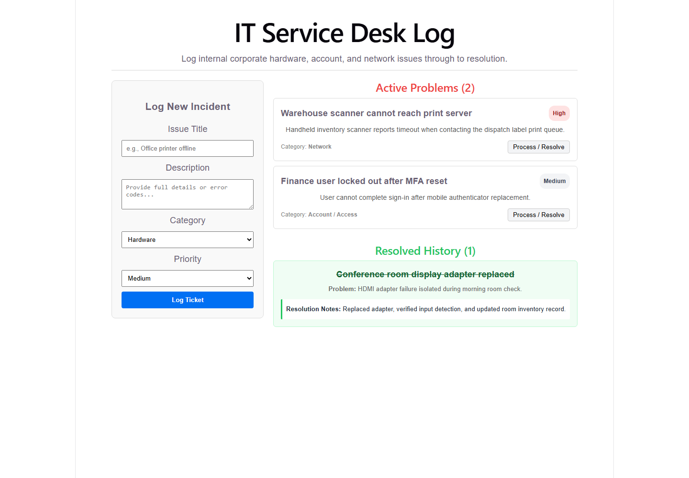

# IT Ticket Dashboard
> **The 1-Line Mission:** React-based incident management dashboard integrating Supabase database triggers to log, classify, and audit helpdesk support tickets.
> **Live Demo:** [it-ticket-dashboard.vercel.app](https://it-ticket-dashboard.vercel.app)

### ⚡ Engineering Breakdown
* **The Problem:** Helpdesk operations suffer from disorganized ticket lifecycles, non-standardized classification structures, and missing resolution audits when tasks are closed without root-cause documentation.
* **The Solution:** A state-driven React application integrating Supabase database triggers, segregating ticket queues (Active/Resolved) via PostgreSQL status properties, and requiring validated resolution input forms before executing ticket update operations.
* **The Tech Stack:** `React` `Vite` `Supabase (Postgres)` `CSS Modules`

---

## 🎥 Visual Preview


---

## ⚙️ Ticket Lifecycle Architecture
```text
Technician Incident Form
          |
          v
Supabase tickets Insert
          |
          v
Ticket Queue State
          |
          +--> Active Problems
          |
          +--> Resolution Workbench
                    |
                    v
             Supabase status update
                    |
                    v
              Resolved History
```

*   **Offline Fallback Mode:** Initializes with local demo ticket data if the Supabase environment connection is missing or offline.
*   **Queue Segmentation:** Dynamic sorting split into Active tickets and Resolved History using PostgreSQL statuses.
*   **Mandatory Resolution Audits:** Enforces technician documentation input for problem resolutions before updates write back to the database.
*   **Audit-friendly Logs:** Persists historical problem records with their associated troubleshooting resolutions for compliance reviews.

---

## 🛠️ Local Setup

1. Clone the repository and install dependency nodes:
   ```bash
   npm install
   ```
2. Start the local server:
   ```bash
   npm run dev
   ```
3. Open your browser to: `http://localhost:5173`.


## Recent Architectural Upgrades
- **Structural Hygiene:** Reorganized the repository into distinct `src/`, `backend/`, and `tests/` directories.
- **Security Enhancements:** Implemented constant-time cryptographic token verification to prevent timing attacks.
- **Database Schema Upgrades:** Refactored primitive types into native data structures (e.g., Dates and Times) for robust ORM integration.
- **Code Hygiene:** Eradicated dead code, legacy logs, and enforced strict linting/testing standards.
